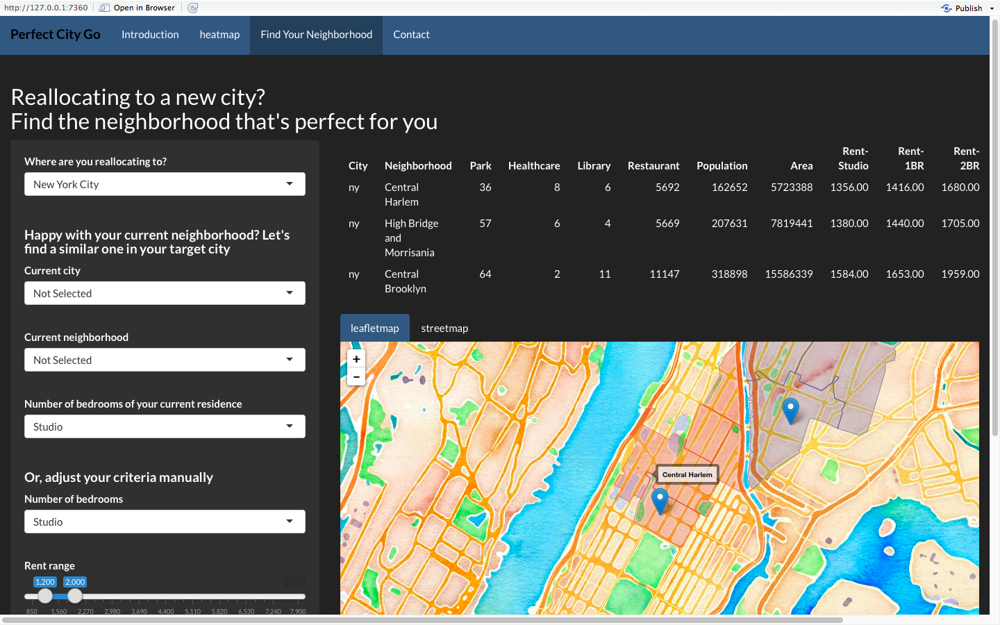

# Project 2: Open Data App - an RShiny app development project

### [Perfect City Go](https://guanzy.shinyapps.io/trafficcare2/)



## Perfect City Go 
Term: Spring 2017

+ Team #8
+ Perfect City Go
	+ Mengchen Li :ml3890@columbia.edu
	+ Yuan Mei :ym2583@columbia.edu
	+ Zheren Tang :zt2191@columbia.edu
	+ Bo Peng :bp2494@columbia.edu
	+ Ruochen Liu :rl2841@columbia.edu

+ **Project summary**: Noticing USA is becoming more and more popular for people all around the word, especially for several famous cities such as New York, Chicago, Austin, Los Angeles and San Francisco, we want to give you advice when you move to another city, finding your best neighborhood. Our project presents visualizations for job opportunities both for different types and differnet cities, wages differences, population and other facilities and enables users to pinpoint the most importatn factors to finally search the most suitable place with map.

+ **Contribution statement**: All team members contributed equally in all stages of this project. 

All group members designed the study, discussed the framework of the app and collected data from data.gov. Mengchen Li made plans, wrote city description and designed heatmap part together with Zheren Tang. Ruochen Liu transformed and merged raw data and wrote server for relocation while Bo Peng wrote ui part. Yuan Mei designed visualiztion for selected neighbirhoods. Zheren, Bo Peng and Ruochen enhanced neighborhoods map, and Yuan Mei added street map for neighborhoods. All memebers put together codes and tried to find bugs to debug. Zheren will give the presentation. All team members contributed to the GitHub repository and approve our work presented in our GitHub repository including this contribution statement.

Following [suggestions](http://nicercode.github.io/blog/2013-04-05-projects/) by [RICH FITZJOHN](http://nicercode.github.io/about/#Team) (@richfitz). This folder is orgarnized as follows.

```
proj/
├── app/
├── lib/
├── data/
├── doc/
└── output/
```

Please see each subfolder for a README file.

